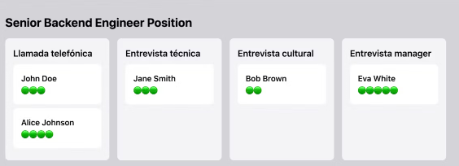

# Prompts

## Prompt 1: Crear estructura base de la página "Position" en modo Kanban

Como desarrollador frontend experto, necesito que crees la interfaz "Position", una página en la que se pueda visualizar y gestionar los candidatos de una posición específica.

La interfaz debe seguir un diseño tipo kanban, donde cada columna representa una fase del proceso de entrevistas y cada candidato es una tarjeta ubicada en la columna correspondiente a su fase actual.

### Requisitos de diseño:

- Mostrar el título de la posición en la parte superior.
- Incluir una flecha a la izquierda del título para volver al listado de posiciones.
- Mostrar tantas columnas como fases tenga el proceso de entrevistas.
- Las tarjetas deben mostrar el nombre completo del candidato y su puntuación media.
- Implementar drag-and-drop para mover candidatos entre columnas y actualizar su fase.
- Optimizar visualización para dispositivos móviles: columnas apiladas verticalmente ocupando todo el ancho.

Asume que esta vista se incrusta en una estructura ya existente (menú superior, footer, etc.), por lo que solo debes generar el contenido principal.

Ejemplo: 

## Prompt 2: Integrar datos del proceso de entrevistas

En la página "Position", usa el endpoint GET `/positions/:id/interviewFlow` para obtener los datos del proceso de entrevistas:

- `positionName`: para mostrar el título.
- `interviewSteps`: lista de fases ordenadas, cada una con `id` y `name`.

### Usa estos datos para:

- Mostrar el título en la cabecera.
- Renderizar las columnas en el tablero kanban (una por cada fase).
- Identificar a qué columna corresponde cada candidato.

Asume que el `:id` de la posición está disponible como parámetro en la ruta o variable de entorno.

## Prompt 3: Cargar y ubicar candidatos por fase

Usa el endpoint GET `/positions/:id/candidates` para obtener todos los candidatos para una posición. Cada objeto candidato incluye:

- `fullName`: nombre completo.
- `currentInterviewStep`: nombre de la fase en la que está.
- `averageScore`: puntuación media.

Para cada candidato, crea una tarjeta en la columna correspondiente a su `currentInterviewStep`. Muestra claramente el nombre completo y la puntuación.

Asegúrate de asociar correctamente la fase por nombre (coincidir con los datos del `interviewFlow`).

## Prompt 4: Implementar lógica de arrastrar y actualizar fase

Implementa funcionalidad de drag-and-drop para permitir mover una tarjeta de candidato entre columnas (fases).

Al soltar una tarjeta en una nueva columna, realiza una llamada a PUT `/candidates/:id/stage` con los siguientes datos:

```json
{
  "applicationId": "ID del candidato",
  "currentInterviewStep": "ID de la nueva fase"
}
```

La columna destino proporciona el `interview_step_id`, que corresponde al nuevo estado.
Tras actualizar, muestra un mensaje de éxito y refresca los datos o actualiza el estado local para reflejar el cambio.

## Prompt 5: Adaptar a móviles y UX adicional

Mejora la visualización del kanban para pantallas móviles:

- Las columnas deben apilarse verticalmente.
- Las tarjetas deben ocupar todo el ancho disponible dentro de su fase.
- Usa diseño responsive basado en flex o grid.

Opcional: Agrega indicadores visuales que mejoren la experiencia de arrastrar y soltar (highlight en la columna activa, opacidad al mover, etc.).